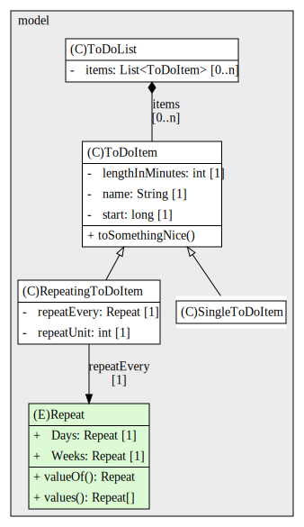

## Diagram Extension

The diagram generation has some limitations and cannot decide everything out of the code. E.g. there is 
no rule to decide if an association is an aggregation or composition within the structure diagram. To 
overcome this you can define an extension / callback to manipulate the diagram string before saving it. 

### Extension Callback 

The callback is invoked directly before saving the diagram and contains all information including the 
metadata section. So be aware to not destroy the format or metadata to ensure a correct rendering and 
re-generation of the diagram.

The diagram can be modified by simple string manipulation or via API provided 
by [graphviz-java](https://github.com/nidi3/graphviz-java).

```java
package examples.customization;

import examples.customization.replace.EdgeModification;
import examples.customization.replace.NodeModification;

import static examples.customization.replace.Modification.modify;

// class needs to be compiled before generating the diagram!
public class EdgeCustomization {

    public static String changeEdges(String diagram){
        return modify(diagram,
                new EdgeModification("ToDoList439207095 -> ToDoItem439207095")
                        .composition()
                        .cardinality("[0..n]"),
                new NodeModification("ToDoList439207095")
                        .cardinality("items", "[0..n]")

        );
    }
}
```
[Source Code](https://github.com/apfau87/plantuml-generation-intellij-plugin/blob/main/src/test/java/examples/customization/EdgeCustomization.java)

### Generated Diagram

The node ToDoList and the edge to ToDoItem is now changed. The cardinality is replaced with '[0..n]' and the edge is 
an aggregation instead of an association.


